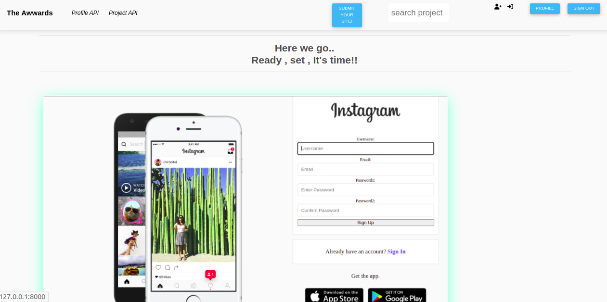
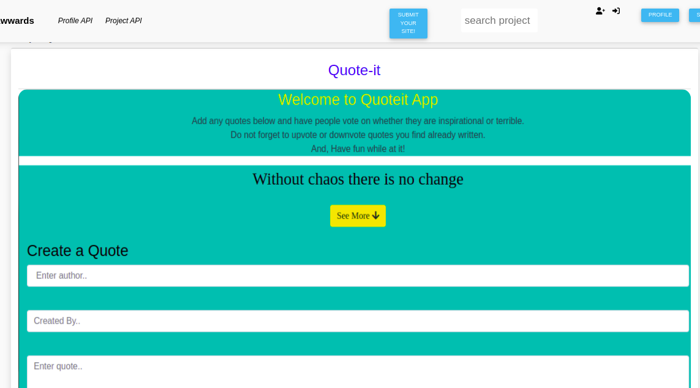
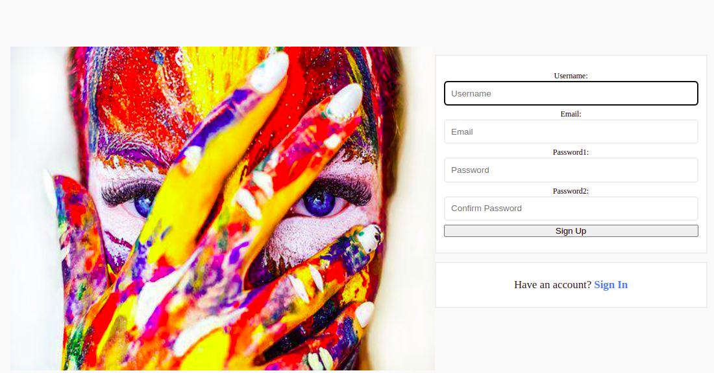
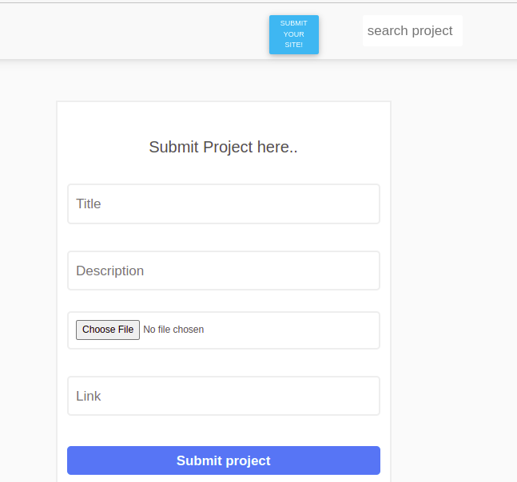

  **Sneakpeak**

 **Written by : Mugure Njung'e**

The Awwards is an application showcasing a collection of projects from different users. Users get to view projcts and sign in/sign up in order to cast votes or add their own projects.

  **Project description**

Users get to view projects uploaded and see ratings on each project.

Users can search for projects and if found, tap on project name to get redirected to the live project.

  **BDD**

Click on the project link and browse though the projects as you view the functionality and content.

If you wish to cast a vote or add your own project, tap on the respective icons and get redirected to the signup/signin page.

Edit your profile by addig profile pic, name, bio and address.

Add as many projects as you would like and get ready to have them vetted by other users.

  **Getting Started**

To clone the repository, run: 

git clone https://github.com/MugureNjunge/review-me

Then navigating to the cloned directory:

cd awwards 

Proceed from there as you see fit.

  **Requirements**

The awwards app requires one to understand :

Django Framework

Python3.8

Postgres

Virtual environment

Cloudinary

Creating and using APIs

  **Setup and installation**

Install and activate virtual environment

Install all dependancies

Create the Database

- psql

- CREATE DATABASE <name>

Create .env file

Create your cloudinary profile

  **Run initial Migration**

python3.8 manage.py makemigrations 

python3.8 manage.py migrate

  **Run the application**

python3.8 manage.py runserver

Follow link provided after running to open app on local host:8000

  **Deployment**

The application is deployed on Heroku and is live on this link : 

  **Built With/Technologies**

Django 4 - Back end logic

Bootstrap - Application design

Pillow - Upload images

Django rest frameworks

Crispy forms library - for all forms

Cloudinary - to ensure pictures retain their quality.

  **Contact:**

Incase of any question or contributions, you can contact me through: maureen.njunge@student.moringaschool.com

  **License**

This project is licensed under the terms of the MIT license

  **Copyright (c) 2022 The Awwards**

